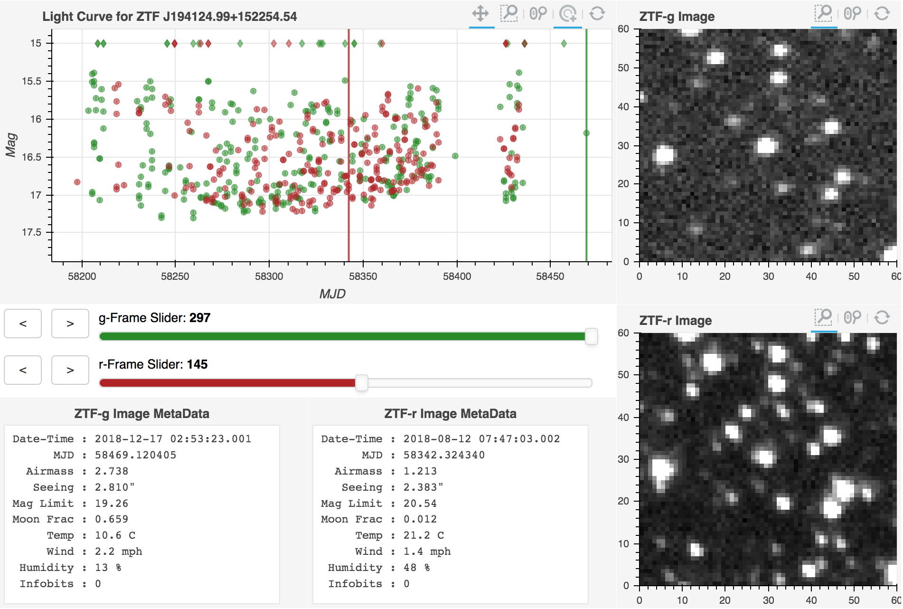

## A Bokeh-based Light Curve and Image Inspection Tool (lc_interact.py)

This python script generates a web application running on a Bokeh server which allows for the visual inspection of ZTF light curves and images for a single object.

As input this script requires a ZTF lightcurve file named **lc.txt** and a folder named **ZTF_Sci_Files** containing all of the science images in FITS format.  These are the default names provided when light curves and images are downloaded from the [NASA/IPAC Infrared Science Archive](https://irsa.ipac.caltech.edu/Missions/ztf.html). 

From the folder containing your light curve and image data, you can run this app from the command line with:

```
bokeh serve lc_interact.py
```

This will generate output on the command line similar to 

```
Bokeh app running at: http://localhost:5006/lc_interact
```

at which point you should copy and paste the web address into your favorite web browser.

This app has the following dependecies:

* Python 3.5 or later
* Astropy
* Bokeh

If properly loaded, the application should look like the following:



In the light curve plot, circles represent data which have both good quality light curve detections and ZTF science images.  Diamonds represent the time-locations of images which do not have corresponding light curve data points, most likely due to low photometric quality of the images.

In addition, this applcation only shows light curve data points which have *catflags=0*, a condition recommended in the [ZTF Science Data System Explanatory Supplement](http://web.ipac.caltech.edu/staff/fmasci/ztf/ztf_pipelines_deliverables.pdf). Data points with *catflags>0* are also likely to have poor photometric quality.
